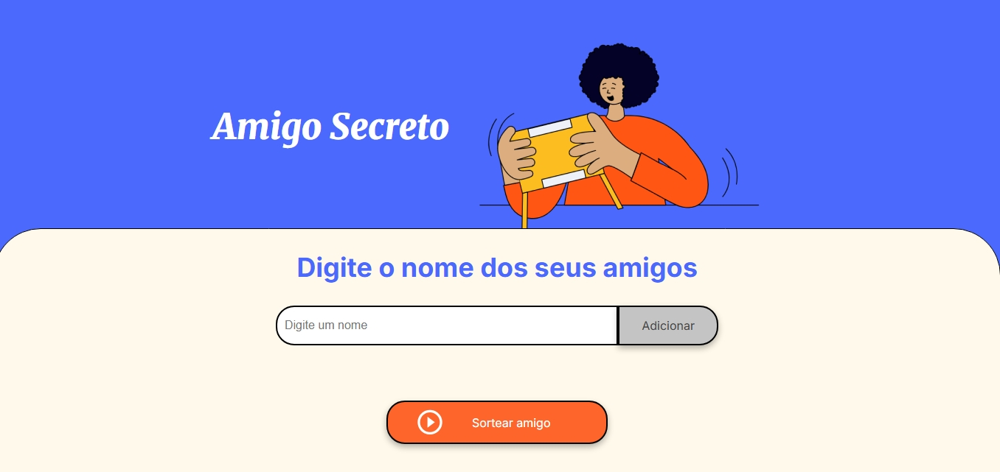

#  Projeto Amigo Secreto

Este é um projeto simples e divertido de **Amigo Secreto**, desenvolvido com o objetivo de sortear participantes de forma justa e automatizada.

##  Funcionalidades

- ✅ Adicionar nomes dos participantes
- 🔁 Sortear pares de Amigo Secreto automaticamente
- 📄 Visualizar resultado individual (quem tirou quem)
- 🗑️ Limpar participantes e começar um novo sorteio

##  Tecnologias utilizadas

- HTML5
- CSS3
- JavaScript

##  Capturas de tela

###  Tela inicial:

###  Resultado do sorteio:

